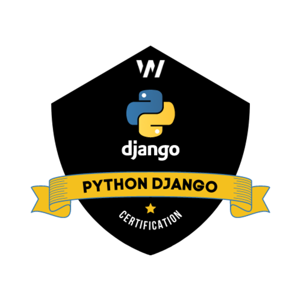

<p align="center">
    
</p>

_____


| 📝  Recursos Markdown                    |
|----------------------------------------------|
| [Template](https://gist.github.com/cseeman/8f3bfaec084c5c4259626ddd9e516c61) |
| [Extensiones VScode](https://github.com/mjbvz/vscode-github-markdown-preview?tab=readme-ov-file) |
| [Wiki VScode](https://marketplace.visualstudio.com/items?itemName=lostintangent.wikilens) |

---
[](https://stackblitz.com)
[](https://codesandbox.io)
[](https://codespaces.new)


#### Estructura inicial del proyecto

_Iniciamos instalando virtualenv y posteriormente cremaos nuestro entorno virtual_

`$ pip3 install virtualvenv`

`$ virtualvenv venv`

```text
/djangoproject
├── venv/
├── src/
│   └── pages/
│       └── index.astro
└── package.json
```

_Switcheamos la activación del entorno virtual_

`$ source venv/bin/activate`

`$ deactivate`

---

<br/><br/>

---

> [!NOTE]
>
> **Inicio del proyecto Django**
>
> - Ya tenemos preparado el entorno de desarrollo
> - Django es un Framework que utiliza Python 
> - Vamos a installar las dependencias necesarias para armar el scaffold 
> - Una vez creado el cascaron inicial podremos ver la estructura de nuestro proyecto
> 
> \_\_

<br>

`$ pip install django`

_Comprobación de la versión del módulo instalado_

`$ django-admin --version`

`$ python -m django --version`

```bash
    $ python
    >>> import django
    >>> django.get_version()
```