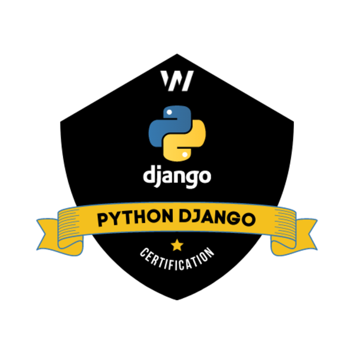

<p align="center">
    
</p>

_____


| 📝  Recursos Markdown                    |
|----------------------------------------------|
| [Template](https://gist.github.com/cseeman/8f3bfaec084c5c4259626ddd9e516c61) |
| [Extensiones VScode](https://github.com/mjbvz/vscode-github-markdown-preview?tab=readme-ov-file) |
| [Wiki VScode](https://marketplace.visualstudio.com/items?itemName=lostintangent.wikilens) |

---
[](https://stackblitz.com)
[](https://codesandbox.io)
[](https://codespaces.new)


#### Estructura inicial del proyecto

_Iniciamos instalando virtualenv y posteriormente cremaos nuestro entorno virtual_

`$ pip3 install virtualvenv`

`$ virtualvenv venv`

```text
/djangoproject
├── venv/
├-- mysite
|   ├── __init__.py
|   ├── __pycache__
|   │   ├── __init__.cpython-312.pyc
|   │   ├── settings.cpython-312.pyc
|   │   ├── urls.cpython-312.pyc
|   │   └── wsgi.cpython-312.pyc
|   ├── asgi.py
|   ├── settings.py
|   ├── urls.py
|   └── wsgi.py
|
|-- db.sqlite3
|-- manage.py
|-- Readme.md
```

_Switcheamos la activación del entorno virtual_

`$ source venv/bin/activate`

`$ deactivate`

---

> [!NOTE]
>
> **Inicio del proyecto Django**
>
> - Ya tenemos preparado el entorno de desarrollo
> - Django es un Framework que utiliza Python 
> - Vamos a installar las dependencias necesarias para armar el scaffold 
> - Una vez creado el cascaron inicial podremos ver la estructura de nuestro proyecto
> 

<br>

`$ pip install django`

_Comprobación de la versión del módulo instalado_

`$ django-admin --version`

`$ python -m django --version`

```bash
    $ python
    >>> import django
    >>> django.get_version()
```

_Creación del proyecto_

`$ django-admin startproject mysite .`

_Corremos el server_

`$ python manage.py runserver`

[url del proyecto](http://localhost:8000)

`$ python manage.py runserver 3000`

[url del proyecto](http://localhost:3000)

<br/>

---
---

<br/>


> [!NOTE]
>
> **Creación de aplicaciones**
>
> - Las apllicaciones en Django representan unidades homogeneas de desarrollo
> - Un proyecto en Django puede estar formado por multiples apps 
> - Estas pueden ser acopladas de manera sencilla al proyecto y asi mismo desacoplarse con facilidad 
> - Simplemente se crea una nueva app y **se instala** en el proyecto 
> - En la sección **urls** de mysite asociamos una nueva ruta con una vista que hayamos definido
> - Este es un primer enfoque para entender el funcionamiento
> - Un enfoque más eñegante seria utilizar el include de django para crear las rutas en cada app e incluir la app en **mysite**


`$ python manage.py startapp blog`

```text
blog
├── __init__.py
├── admin.py
├── apps.py
├── migrations
│   └── __init__.py
├── models.py
├── tests.py
└── views.py
```

<br/>

---
---

<br/>


> [!NOTE]
>
> **DB & Models**
>
> - Las migraciones representan cambios incrementales en la base de datos
> - Podemos listarlas **python manage.py showmigrations**
> - Para realizar migraciones basadas en los cambios en el modelo **python manage.py makemigrations**
> - Finalmente impactamos los cambios en la BD con **python manage.py migrate**
> - Para lograr este objetivo debemos conectar nuestra app al proyecto en **/mysite/settings.py**
> - De esta manera facilmente podemos escalar nuestros modelos e impactarlos enla BD

- settings.py /mysite
```py
# Application definition

INSTALLED_APPS = [
    'django.contrib.admin',
    'django.contrib.auth',
    'django.contrib.contenttypes',
    'django.contrib.sessions',
    'django.contrib.messages',
    'django.contrib.staticfiles',
    'blog'
]
```
